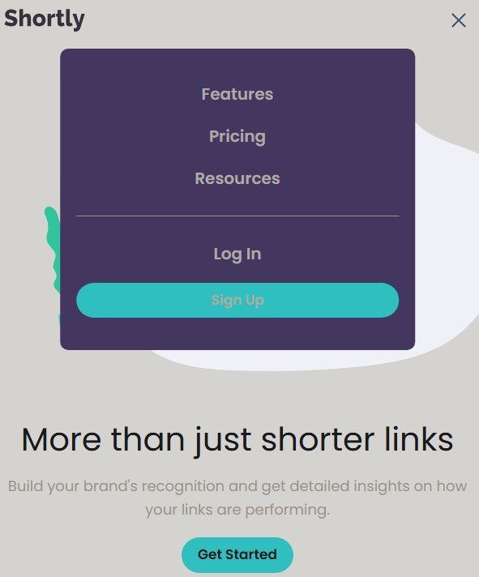

# Frontend Mentor - Shortly URL shortening API Challenge solution

This is a solution using React to the [Shortly URL shortening API Challenge challenge on Frontend Mentor](https://www.frontendmentor.io/challenges/url-shortening-api-landing-page-2ce3ob-G). Frontend Mentor challenges help you improve your coding skills by building realistic projects. 

## Table of contents

- [Overview](#overview)
  - [The challenge](#the-challenge)
  - [Screenshot](#screenshot)
  - [Links](#links)
- [My process](#my-process)
  - [Built with](#built-with)
  - [What I learned](#what-i-learned)
  - [Continued development](#continued-development)
  - [Reflections](#reflections)
  - [Useful resources](#useful-resources)
- [Acknowledgments](#acknowledgments)

## Overview

Integrate with the [bitly](https://app.bitly.com/) URL shortening API and play with browser storage in this landing page challenge.

Your challenge is to integrate with the [bitly API](https://dev.bitly.com/) to create shortened URLs and display them like in the designs.

### The challenge

Users should be able to:

- View the optimal layout for the site depending on their device's screen size
- Shorten any valid URL
- See a list of their shortened links, even after refreshing the browser
- Copy the shortened link to their clipboard in a single click
- Receive an error message when the `form` is submitted if:
  - The `input` field is empty

### Screenshot





### Links

- Solution URL: [GitHub: url-shortening-api-master](https://github.com/DblRH600/url-shortener-api-react)
- Live Site URL: [Shortly](https://shiny-unicorn-f991cf.netlify.app/)

**Note:** Monthly limit is ***5*** Links. Three links were used trying to test the site.

## My process

### Built with

- React
- Vite
- Tailwinds
- CSS custom properties
- Flexbox
- CSS Grid
- Mobile-first workflow

### What I learned

Updating / reworking the URL Shortening project to use REACT tested and reinforced practices of the **useState** and **useEffect** methods for managing *State* properties. It also tested implementation of best practices for utilizing **Async** / **Await** and **Try** / **Catch** functionality.


```jsx URL Section
function UrlShortenerSection() {
  const [url, setUrl] = useState("");
  const [shortenedUrls, setShortenedUrls] = useState(() => {
    const storedUrls = localStorage.getItem("shortenUrl");
    return storedUrls ? JSON.parse(storedUrls) : [];
  });
  const [errorMessage, setErrorMessage] = useState("");
  const [loading, setLoading] = useState(false);
  const [copiedIndex, setCopiedIndex] = useState(null);

  // use effect to save data when changes are made
  useEffect(() => {
    localStorage.setItem("shortenUrl", JSON.stringify(shortenedUrls));
  }, [shortenedUrls]);

  const handleSubmit = async (e) => {
    e.preventDefault();

    if (!url) {
      setErrorMessage("Please add a link to shorten");
    }

    try {
      setLoading(true);
      const res = await fetch(BITLY_API, {
        method: "POST",
        headers: {
          "Content-Type": "application/json",
          Authorization: `Bearer ${TOKEN}`
        },
        body: JSON.stringify({ long_url: url }),
      });

      const data = await res.json();

      if (res.ok) {
        setShortenedUrls([
          ...shortenedUrls,
          {
            originalUrl: url,
            shortUrl: data.link,
          },
        ]);

        setErrorMessage("");
        setUrl("");
      } else {
        console.log(data.error);
      }
    } catch (error) {
      console.log(error);
    } finally {
      setLoading(false);
    }
  };

  const handleCopy = (shortUrl, index) => {
    navigator.clipboard.writeText(shortUrl);
    setCopiedIndex(index);

    setTimeout(() => {
      setCopiedIndex(null);
    }, 2000);
  };

  return ...
}
```

### Continued development

I need to build futher understanding on where the **useState** hook should be placed and when to utilize ***props*** when passing functionality between parent and component connections. Understanding how to develop custom hooks was crucial to the productivity and reusability of the code blocks. This project also tested the ability to use context functions effectively.

### Reflections

### Useful resources

- [Documentation: React](https://react.dev/reference/react) - ***React.dev*** provides useful documentation and examples for how to use **useState** and **useCallback** hooks.

- [Documentation: The Bitly API](https://dev.bitly.com/?_gl=1*18syhe2*_gcl_au*MzI4MzI3MzM5LjE3NDkyMjY0MzcuMTcwMTE2NjY1NC4xNzQ5MjI5MTQ3LjE3NDkyMjkyMTE.) - This is site helped with my understanding of how to use the API for this website.

## Acknowledgments

I want express aprpeciation to Abraham Tavarez Colton Wright for their help with understading how to connect the ***API Token*** from *bitly.com*, and how **useState** should be implemented in order for its use for each **component** impacted. Additional shout out to [Dev-Lawrence](https://www.youtube.com/watch?v=BKwu82wekLU&t=136s) for the reat tutorial on the Frontend Mentor project
